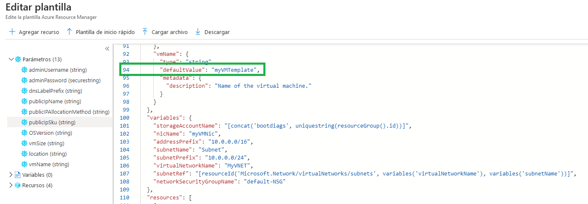

---
wts:
    title: '09 - Crear una máquina virtual con una plantilla'
    module: 'Módulo 02 - Servicios principales de Azure'
---
# 09 - Crear una máquina virtual con una plantilla

En este tutorial implementaremos una máquina virtual con una plantilla de inicio rápido y examinaremos las capacidades de monitoreo.

# Tarea1: Explore la galería y localice una plantilla

En esta tarea, examinaremos la galería Azure QuickStart e implementaremos una plantilla que crea una máquina virtual. 

1. En el explorador, acceda a [Galería de plantillas de Azure Quickstart](https://azure.microsoft.com/resources/templates?azure-portal=true). En la galería encontrará una serie de plantillas populares y recientemente actualizadas. Estas plantillas automatizan la implementación de los recursos de Azure, incluida la instalación de paquetes de software populares.

2. Explore los diferentes tipos de plantillas disponibles. 

    **Nota**: ¿Hay alguna plantilla que le interese?

3. Busque o acceda directamente a la plantilla [Implementar una máquina virtual de Windows simple](https://azure.microsoft.com/resources/templates/101-vm-simple-windows?azure-portal=true).

    **Nota**: El botón **Implementar en Azure** le permite implementar la plantilla a través de Azure Portal. Durante dicha implementación, se le pedirá confirmación solo de un pequeño conjunto de parámetros de configuración. 

4. Haga clic en el botón **Implementar en Azure**. Su sesión del explorador se redirigirá automáticamente a [Azure Portal](http://portal.azure.com/).

5. Si se le solicita, inicie sesión en la suscripción de Azure que desea usar en este laboratorio.

6. Haga clic en **Editar plantilla**. El formato de la plantilla de Resource Manager usa el formato JSON. Revise las variables y localice el nombre de la máquina virtual. Cambie el nombre a **myVMTemplate**. Seleccione **Guardar** para guardar los cambios. Regresa a la hoja **Implementación personalizada** en el Azure Portal.

    

7. En la hoja **Implementación personalizada**, configure los parámetros requeridos por la plantilla (reemplace ***xxxx*** en el prefijo de la etiqueta DNS con letras y dígitos de modo que la etiqueta sea globalmente única). Deje los valores predeterminados para todo lo demás. 

    | Configuración| Valor|
    |----|----|
    | Suscripción | **Elija su suscripción**|
    | Grupo de recursos | **myRGTemplate-[deployId]** (crear nuevo) |
    | Ubicación | **Este de EE. UU.** |
    | Nombre del usuario administrador | **azureuser** |
    | Contraseña del administrador | **Pa$$w0rd1234** |
    | Prefijo de etiqueta DNS | **myvmtemplate*xxxx*** |
    | Versión del sistema operativo Windows | **2019-Centro de datos** |
    | | |

8. Marque la casilla **Acepto los términos y las condiciones establecidos anteriormente** y luego haga clic en **Comprar**.

    **Nota**: No hay coste asociado con esta plantilla.

9. Supervise su implementación. 

# Tarea 2: Compruebe la máquina virtual y haga un seguimiento de ella

En esta tarea, comprobaremos que la máquina virtual se implementó correctamente. 

1. Desde la hoja **Todos los servicios**, busque y seleccione **Maquinas virtuales**.

2. Asegúrese de que se haya creado su nueva máquina virtual. 

    

3. Seleccione su máquina virtual y en el panel **Información general** desplácese hacia abajo para ver los datos de supervisión.

    **Nota**: El plazo de supervisión se puede ajustar de una hora a 30 días.

4. Revise los diferentes cuadros que se proporcionan, incluidos **CPU (promedio)**, **Red (total)** y **Bytes de disco (total)**. 

    

5. Haga clic en cualquier gráfico. Tenga en cuenta que puede seleccionar **Agregar métrica** y cambiar el tipo de gráfico. Dado que tiene tiempo, experimente. 

6. Vuelva a la hoja **Visión general**.

7. Haga clic en el **Registro de actividades** (panel izquierdo). Los registros de actividad registran eventos tales como la creación o modificación de recursos. 

8. Haga clic en **Añadir filtro** y experimente buscando diferentes tipos de eventos y operaciones. 

    

**Nota**: Para evitar costes adicionales, puede eliminar este grupo de recursos. Busque grupos de recursos, haga clic en su grupo de recursos y, a continuación, haga clic en **Eliminar grupo de recursos**. Compruebe el nombre del grupo de recursos y luego haga clic en **Eliminar**. Supervise las **Notificaciones** para ver cómo se realiza la eliminación.
