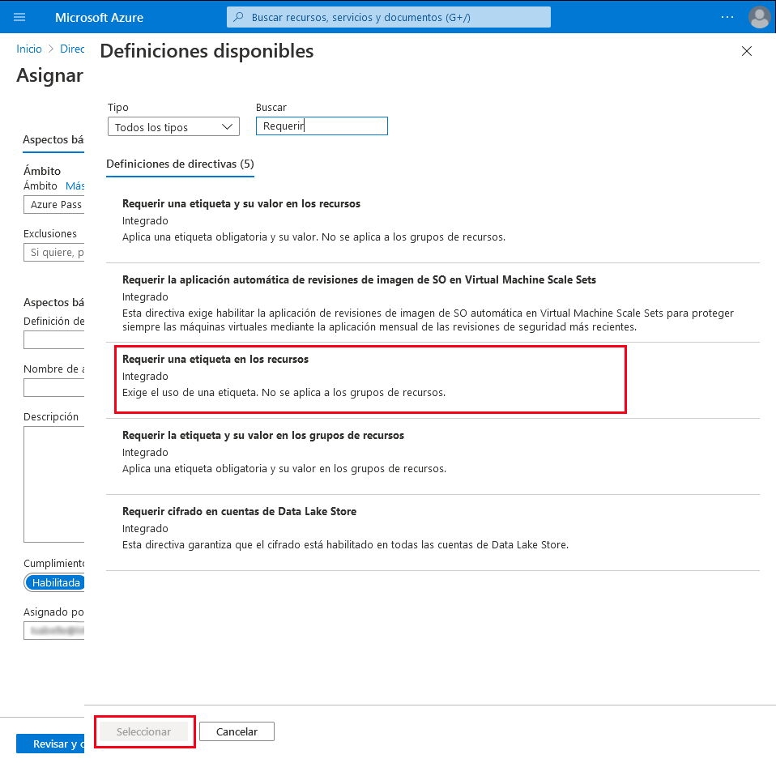

---
wts:
    title: '16 - Implementar etiquetado de recursos (5 minutos)'
    module: 'Módulo 05: Descripción de las características de identidad, gobernanza, privacidad y cumplimiento'
---
# 16 - Implementar etiquetado de recursos

En este tutorial, crearemos una asignación de directivas que requiera etiquetado, crearemos una cuenta de almacenamiento y probaremos el etiquetado, veremos recursos con una etiqueta específica y quitaremos la directiva de etiquetado.

# Tarea 1: Crear una asignación de directiva (5 minutos)

En esta tarea, configuraremos la directiva **Requerir una etiqueta en los recursos** y la asignaremos a nuestra suscripción. 

1. Inicie sesión en [Azure Portal](https://portal.azure.com).

2. Desde la hoja **Todos los servicios**, busque y seleccione **Directiva**.

3. Desplácese hacia abajo hasta la sección **Creación**, haga clic en **Asignaciones** y luego haga clic en **Asignar directiva** desde la parte superior de la página.

4. Tenga en cuenta que el **Ámbito** para nuestra directiva será toda la suscripción. 

5. Seleccione el botón de puntos suspensivos **Definición de la política** (al final del cuadro de texto de la derecha). **Busque** definiciones de directivas que incluyen la **etiqueta** de valor, en el conjunto de resultados, haga clic en la definición **Requerir una etiqueta en los recursos**, luego haga clic en **Seleccionar**.

   

6. En la hoja **Asignar directiva**, en la pestaña **Parámetros**, escriba **Empresa** para el nombre de la etiqueta. Haga clic en **Revisar + crear** y, luego, en **Crear**.

    **Nota:** Este es un ejemplo simple para demostrar el etiquetado. 

    

7. La asignación de la directiva **Requerir una etiqueta en los recursos** ahora está implementada. Cuando se crea un recurso, debe incluir una etiqueta con la clave de compañía.

   

# Tarea 2: Cree una cuenta de almacenamiento para probar el etiquetado requerido

En esta tarea crearemos cuentas de almacenamiento para probar el etiquetado requerido. 

1. En el Azure Portal, desde la hoja **Todos los servicios**, busque y seleccione **Cuentas de almacenamiento** y luego haga clic en **+ Añadir**.

2. En la pestaña **Datos básicos** de la hoja **Crear cuenta de almacenamiento**, complete la siguiente información (reemplace **xxxx** en el nombre de la cuenta de almacenamiento con letras y dígitos de modo que el nombre sea globalmente único). Deje los valores predeterminados para todo lo demás.

    | Configuración | Valor | 
    | --- | --- |
    | Suscripción | **Use su suscripción** |
    | Grupo de recursos | **myRGTags** (nuevo) |
    | Nombre de la cuenta de almacenamiento | **storageaccountxxxx** |
    | Ubicación | **Este de EE. UU.** |
    | | |

3. Haga clic en **Revisar + Crear**. 

    **Nota:** Estamos probando para ver qué sucede cuando no se suministra la etiqueta. 

4. Recibirá un mensaje de error de validación. Haga clic en el mensaje **Haga clic aquí para ver los detalles**. En la hoja **Errores**, en la pestaña **Resumen**, observe el mensaje de error que indica que la directiva no permite el recurso.

    **Nota:** Si ve la pestaña Error sin formato, verá el nombre de etiqueta específico que se necesita. 

    

    **Nota: Debe esperar 30 minutos hasta que se complete el etiquetado.** 

5. Cierre el panel de **Error** y haga clic en **Anterior** (parte inferior de la pantalla). Proporcione la información de etiquetado. 

    | Configuración | Valor | 
    | --- | --- |
    | Nombre de etiqueta | **Compañía** (puede no estar en la lista desplegable) |
    | Valor de la etiqueta | **Contoso** |
    | | |

6. Haga clic en **Revisar + crear** y verifique que la validación haya sido exitosa. Haga clic en **Crear** para implementar la cuenta de almacenamiento. 

# Tarea 3: Vea todos los recursos con una etiqueta específica

1. En Azure Portal, desde la hoja **Todos los servicios**, busque y seleccione **Etiquetas**.

2. Tenga en cuenta todas las etiquetas y sus valores. Haga clic en la **Compañía: Contoso** par clave/valor. Esto mostrará una hoja que muestra la cuenta de almacenamiento recién creada, siempre que haya incluido la etiqueta durante su implementación. 

   

3. En el Portal, muestre la hoja **Todos los recursos**.

4. Haga clic en **Añadir filtro** y añada la clave de etiqueta de la **Compañía** como la categoría de filtro. Con el filtro aplicado, solo se mostrará su cuenta de almacenamiento.

    

# Tarea 4 Elimine la asignación de directiva

En esta tarea eliminaremos la directiva **Pedir una etiqueta en los recursos** para que no afecte nuestro trabajo futuro. 

1. En el portal, desde la hoja **Todos los servicios**, busque y seleccione la **Directiva**.

2. Haga clic en la entrada de la directiva **Pedir una etiqueta en los recursos**.

3. Haga clic en **Eliminar asignación** en el panel superior.

4. Confirme que desea eliminar la asignación de directiva en el diálogo **Eliminar asignación** haciendo clic en **Sí**

5. Si tiene tiempo, cree otro recurso sin una etiqueta para asegurarse de que la directiva ya no está vigente.

En este tutorial creamos una asignación de directivas que requería etiquetado, creamos una cuenta de almacenamiento y probamos el etiquetado, vimos recursos con una etiqueta específica y eliminamos las directivas de etiquetado.

**Nota**: Para evitar costes adicionales, puede eliminar este grupo de recursos. Busque grupos de recursos, haga clic en su grupo de recursos y, a continuación, haga clic en **Eliminar grupo de recursos**. Compruebe el nombre del grupo de recursos y luego haga clic en **Eliminar**. Supervise las **Notificaciones** para ver cómo se realiza la eliminación.
